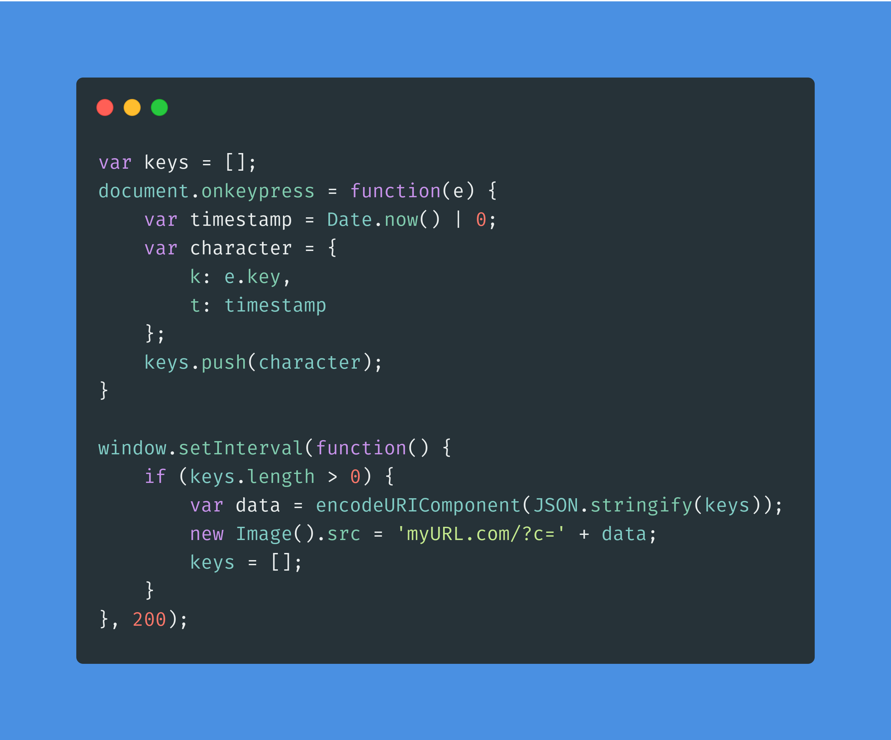
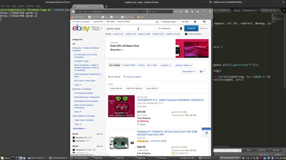

# mitm-proxy
Using a MITM proxy to add a browser-based keylogger to devices on your local network

# How does it work?

This works by injecting the following Javascript code into every request that takes place on the network.

